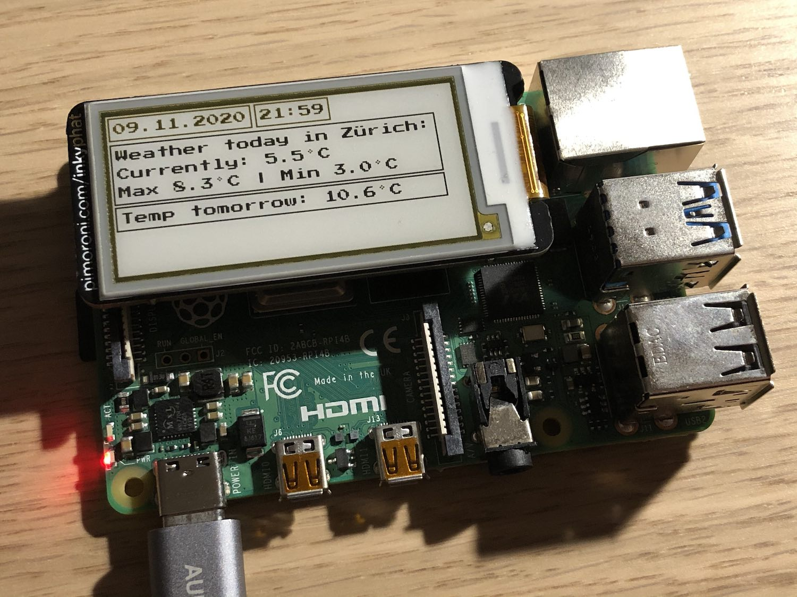

# Inky Dashboard

## The idea
I had an [inky pHat](https://shop.pimoroni.com/products/inky-phat?variant=12549254905939) lying around and I decided that I wanted to have a small little dashboard that I could customise.  
The approach is to have a website based on Angular that is fully customisable to develop components that you could then put on the eInk display.  
This works by compiling the website, running a python server, taking a screenshot in the correct resolution and then painting it on to the display.




# Setup

## Basic setup
- Install inky pHat libraries (https://github.com/pimoroni/inky-phat)
- Install packages with `npm i`
- Setup chromium-browser on the Raspberry Pi
```bash
sudo apt install chromium-browser chromium-codecs-ffmpeg
```

## How to run it
- Rename `src/app/components/weather/weather_api.example.ts` to `weather_api.ts` and add your `apiKey` from https://openweathermap.org/api
- Build with `npm run build` on the Raspberry Pi
- Display with `npm run capture-and-write` (run as cronjob to display regularly)
